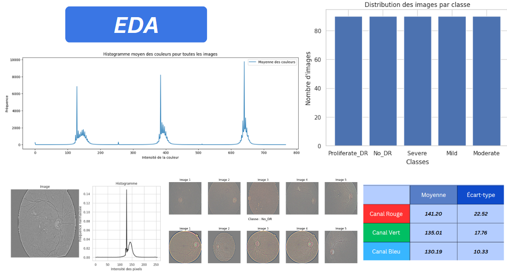
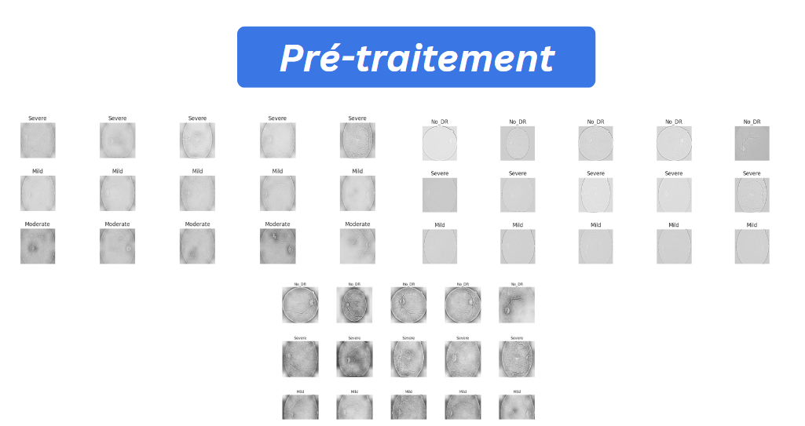
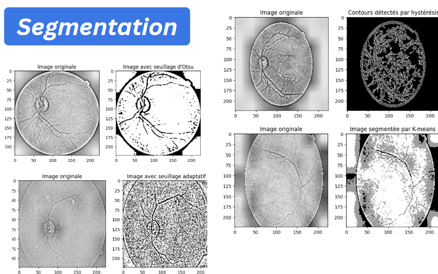

# diabetic-retinopathy-segmentation
## Context of the project :
Diabetic retinopathy (DR) is a serious complication of diabetes mellitus, characterized by elevated levels of glucose in the blood, which affects the blood vessels in the retina and can lead to vision loss
## Objectif of the project :
Automating the diagnosis of diabetic retinopathy by segmenting medical images to identify the different stages of the disease
## About the dataset :
In order to execute the project we used the dataset issued from this link :
https://www.kaggle.com/c/diabetic-retinopathy-detection/data

Below are all the classes from the dataset I’m using here in the project :

- No_DR (No Diabetic Retinopathy): Images with no signs of diabetic retinopathy.  
- Mild (Mild Diabetic Retinopathy): Early and mild signs of the disease.  
- Moderate (Moderate Diabetic Retinopathy): Moderate damage to the blood vessels in the retina.  
- Severe (Severe Diabetic Retinopathy): Advanced vascular damage with a risk of complications.  
- Proliferative_DR (Proliferative Diabetic Retinopathy): The most advanced stage, characterized by abnormal proliferation of blood vessels.

## The steps of this project are :

#### EDA :
- Conducted exploratory data analysis (EDA) to understand the images and their distribution across each class.

#### Preprocessed the images to enhance their visual quality:
- Contrast enhancement.
- Histogram equalization.
- Noise reduction.

#### Segmented the images using several techniques:
- Adaptive thresholding.
- Otsu's thresholding.
- Hysteresis thresholding.
- K-means thresholding.

